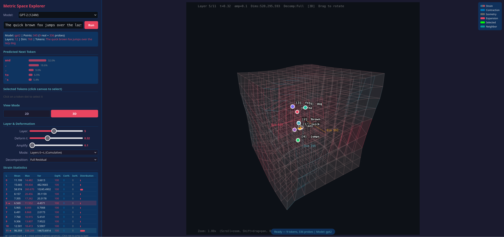
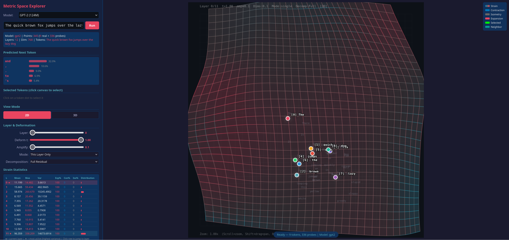
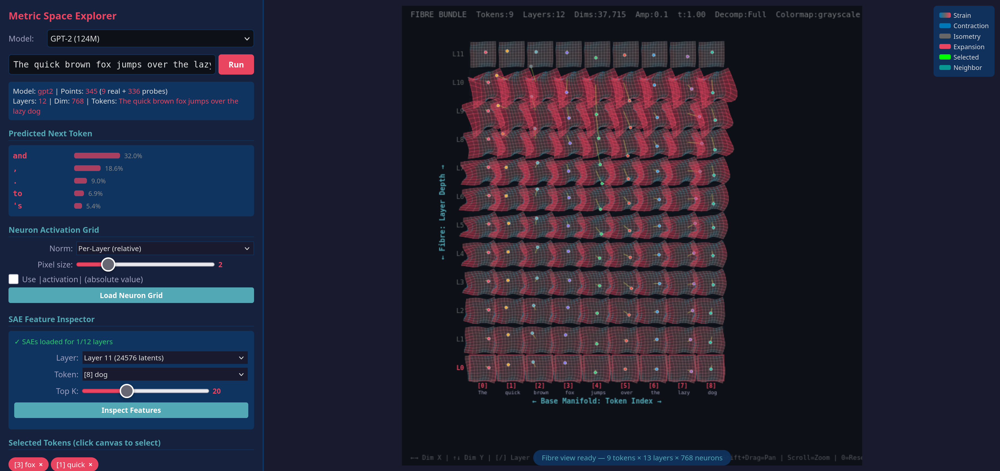

# 🔬 Metric Space Explorer — Transformer Residual Streams





## What is this?

A self-contained visualization tool that reveals **how LLMs deform the metric structure of its hidden representation space** layer by layer. Instead of tracking where tokens "move," it shows how the **fabric of space itself** stretches and compresses around fixed token landmarks — like watching spacetime warp around massive objects.

Each transformer layer applies a residual update`h_{l+1} = h_l + Δ_l`. This tool interprets each layer as a **diffeomorphism** of the representation space:

```
T(p) = p + t · v(p)
```

where`v(p)`is an RBF-interpolated vector field derived from the per-token residual deltas`Δ_l`. A deformable 2D grid visualizes the resulting **metric strain** — where space expands (red), contracts (blue), or stays isometric (gray).

## Key Concepts

- **Tokens are fixed landmarks** — they never move on screen, regardless of layer or deformation strength
- **The grid IS the space** — it deforms to show how the transformer layer warps the metric
- **Strain = deformed distance / original distance** per grid edge
- **Probe points** (from diverse vocabulary sentences + grid-interpolated synthetics) fill the space so the deformation field covers the entire viewport
- **Any 2 of 768 dimensions** can be selected as the viewing slice

## Features

- 🔤 **Enter any text** directly in the browser — no restart needed
- 📐 **Arbitrary dimension slices** (Dim X / Dim Y from 0–767)
- 🎚️ **Layer slider** — scrub through all transformer layers
- ⏱️ **Deformation t** — smoothly interpolate from identity (t=0) to full deformation (t=1)
- 🔊 **Amplify** — scale up small deformations to make them visible
- 📊 **Modes**: Single Layer, Cumulative Forward, Cumulative Backward, Embedding Space
- 🌈 **Strain heatmap** + **strain-colored grid lines**
- 🏹 **Vector field arrows** showing deformation direction
- ⌨️ **Keyboard shortcuts**: Arrow keys, Space (autoplay), A/Z (amplify), R (reset), D (cycle dims)

## Requirements

**None** — the script bootstraps itself. Just run it with any Python 3.7+:

If you don't have `uv` installed, run `curl -LsSf https://astral.sh/uv/install.sh | sh`.

```bash
uv run app.py
```

On first run it will:
1. Create a`.venv`virtual environment
2. Install`torch`,`transformers`,`numpy`via pip
3. Re-launch itself inside the venv
4. Load GPT-2 and open your browser

## Usage

```bash
# Default (gpt2)
python3 app.py

# Choose model
python3 app.py --model gpt2-medium

# Custom port
python3 app.py --port 9000

# Available models: gpt2, gpt2-medium, gpt2-large
```

Then enter any text in the browser and click **Run**.

## How to Read the Visualization

| Visual Element | Meaning |
|---|---|
| 🔴 Red grid regions | Space is **expanding** (strain > 1) |
| 🔵 Blue grid regions | Space is **contracting** (strain < 1) |
| ⚪ Gray grid regions | Space is **isometric** (strain ≈ 1) |
| Colored dots | Real token positions (fixed landmarks) |
| Faint dots | Probe points (synthetic spatial coverage) |
| Grid distortion | The metric deformation induced by the layer |

## Architecture

Everything is a single`app.py`file:

- **Python backend**: Loads GPT-2, extracts hidden states & residual deltas, serves HTTP
- **Browser frontend**: Pure HTML5 Canvas + vanilla JS, all computation client-side
- **No frameworks**: No Gradio, no React, no npm — just a Python`HTTPServer`serving one HTML page
- **No server roundtrips on slider changes**: All data sent once as JSON, deformation computed in the browser

## The Math

**Residual delta per layer:**
```
V_l[j] = h_{l+1}[j] - h_l[j]
```

**RBF-interpolated vector field at grid point p:**
```
v(p) = Σ_j w_j · V_j / Σ_j w_j
w_j = exp(-||p - x_j||² / 2σ²)
```

**Deformation (NOT iterative — single-shot at original point):**
```
T(p) = p + t · v(p)
```

**Metric strain per grid edge:**
```
strain = ||T(p_j) - T(p_i)|| / ||p_j - p_i||
```

## License

MIT
